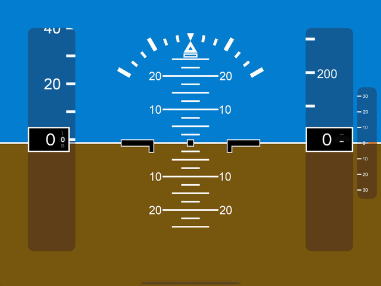
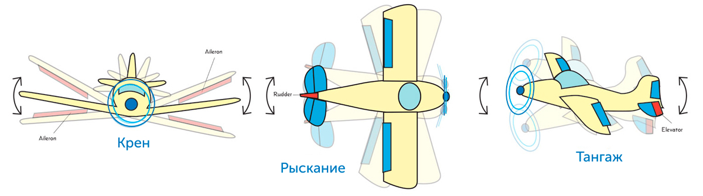

# Авиационный модуль индикации / PFD

> **Проект больше не поддерживается.**
> Оставлен как учебный для ознакомления и истории. 
> Код может быть неполным, устаревшим или содержать учебные упрощения.

Приложение симулирует работу **авиационного командного пилотажного прибора**, установленного на борту самолёта. Модуль отображает пространственное положение воздушного судна в реальном времени и все связанные с ним датчики — так же, как в кабине настоящего самолёта. Прибор имитирует реальную логику пилотажно-навигационного комплекса.

На приборе отображаются:

| Элемент | Назначение |
|---------|-----------|
| **Символ самолёта** | Неподвижная метка центра |
| **Шкала угла тангажа** | Наклон по продольной оси |
| **Индекс и шкала угла крена** | Наклон по поперечной оси |
| **Линия горизонта** | Разделитель неба и земли |
| **Указатель скольжения** | Боковое скольжение |
| **Путевая скорость** | GS190 |
| **Радиовысота** | DH200 / 2000 |
| **Отклонение и шкала скорости** | F — увеличение, S — уменьшение |
| **Отклонение и шкала угла глиссады** | Вертикальная навигация |
| **Индикатор режима автомата тяги** | IAS / G/S |
| **Индикатор режима индикации тангажа** | LOC / CMD |
| **Индикатор состояния** | Командный режим |
| **Отклонение курсового посадочного радиомаяка** | Курс на полосу |

### Управляющие поверхности

  

- **Крен (Roll)** — отклонение элеронов (Aileron).
- **Рыскание (Yaw)** — отклонение руля направления (Rudder).
- **Тангаж (Pitch)** — отклонение руля высоты (Elevator).

Все три оси влияют на показания прибора в реальном времени.
